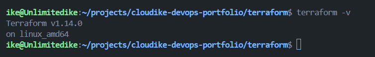

# Day 01 - Terraform Practice

## Goal
- Learn what terraform is about and also how to setup Terraform 
## What I learned
- Terraform is a universal infrastructure as a code tool.
- It's used to create real infrastructure on most of todays cloud platforms.
- Pulumi is another universal Iac tool.
- AWS Cloudformation and Azure ARM, these are cloud navtive Iac(vendor lock-in options).
- Terraform helps reduce time taken to create infrastructure across Environments
- Terraform helps reduce human errors in infrastructure provisioning
- Terraform ensures environments are created consistently 

## installing Terraform

- i installed terraform via powershell i was having issues using the main wsl method 
Opened powershell as administrator
  choco upgrade chocolatey -y
  choco install terraform -y
    I then opened wsl and checked the terraform version
      choco install terraform -y

## How Terraform works
- How Terraform Works Write Terraform files → Run Terraform commands → Call AWS APIs through Terraform Provider
- Terraform Workflow Phases:

terraform init - Initialize the working directory 
terraform validate - Validate the configuration files 
terraform plan - Create an execution plan 
terraform apply - Apply the changes to reach desired state terraform destroy - Destroy the infrastructure when needed 

-  Tasks for Practice Install Terraform Follow the installation guide: https://developer.hashicorp.com/terraform/install

## blog link

## Linkedinpost link

